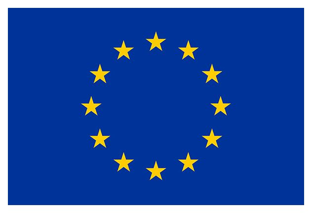

# NeoIPC - Working together to improve Infection Prevention and Control practices in neonatal care settings

Here you can find software and documentation related to the [NeoIPC Project](https://neoipc.org).

For now this is merely a stub but as development of the [surveillance](https://neoipc.org/surveillance/) toolkit procedes, there will be more and more material appearing here.

This project has received funding from the European Union’s Horizon 2020 research and innovation programme under grant agreement No 965328.
